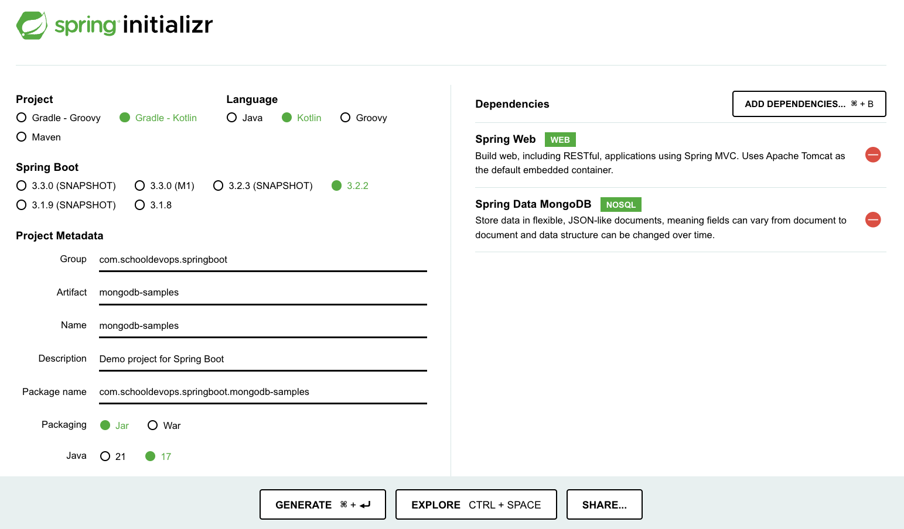

# MongoDB + SpringBoot + Kotlin Tutorials

- SpringBoot + Kotlin + MongoDB를 활용하여 샘플을 만들어보자. 

## 스프링부트 초기화 



- 위와 같이 스프링 초기화 사이트를 활용하여 프로젝트를 구성한다. 
- 의존성 구성
  - web
  - spring data mongodb

## MongoDB Docker Compose

- DocmerCompose를 활용하여 3개의 노드로 구성된 MongoDB Cluster를 구성하자. 

### Docker Compose 파일 작성

- /infra/docker-compose.yaml 파일을 다음과 같이 작성하자. 

```yaml
version: '3'

services:
  mongo1:
    image: mongo
    ports:
      - "27017:27017"
    volumes:
      - ./data1:/data/db
    environment:
      - MONGO_INITDB_ROOT_USERNAME=admin
      - MONGO_INITDB_ROOT_PASSWORD=admin1234
    networks:
      - mongo-cluster-net

  mongo2:
    image: mongo
    ports:
      - "27018:27017"
    volumes:
      - ./data2:/data/db
    environment:
      - MONGO_INITDB_ROOT_USERNAME=admin
      - MONGO_INITDB_ROOT_PASSWORD=admin1234
    networks:
      - mongo-cluster-net

  mongo3:
    image: mongo
    ports:
      - "27019:27017"
    volumes:
      - ./data3:/data/db
    environment:
      - MONGO_INITDB_ROOT_USERNAME=admin
      - MONGO_INITDB_ROOT_PASSWORD=admin1234
    networks:
      - mongo-cluster-net

  mongo-init:
    image: mongo
    depends_on:
      - mongo1
      - mongo2
      - mongo3
    environment:
      - MONGO_INITDB_ROOT_USERNAME=admin
      - MONGO_INITDB_ROOT_PASSWORD=admin1234
    volumes:
      - ./init.js:/docker-entrypoint-initdb.d/init.js
    networks:
      - mongo-cluster-net

networks:
  mongo-cluster-net:
    driver: bridge
```

- 이제 클러스터를 묶어줄 초기화 파일을 생성한다. 
- mongoDB는 json을 이용하므로 init.js파일을 다음과 같이 작성하자.

```js
// init.js
rs.initiate(
   {
      _id: "rs0",
      members: [
         { _id: 0, host: "mongo1:27017" },
         { _id: 1, host: "mongo2:27017" },
         { _id: 2, host: "mongo3:27017" }
      ]
   }
);
```

- docker-compose 실행하기 

```shell
docker-compose up -d
```

### 간단한 mongodb 명령어 

```mongodb-json

// 데이터베이스 목록 조회
show dbs;

// 데이터베이스 사용
use admin;

// 테이블 목록 조회
show collections;
show tables;

// 컬렉션내 데이터 조회
db.system.users.find();
```

- 데이터베이스 목록 조회 
  - `show dbs` 명령어를 사용하여 조회한다.
- 데이터베이스 사용하기 
  - `use admin` 명령어를 사용하여 특정 데이터베이스를 선택한다. 
- 테이블 목록조회 
  - `show collections` 혹은 `show tables` 명령어를 이용하여 컬렉션 목록을 조회할 수 있다. 
- 컬렉션 내 데이터 조회하기 
  - `db.system.users.find()` 를 이용하여 테이블에 대한 데이터를 조회할 수 있다. 